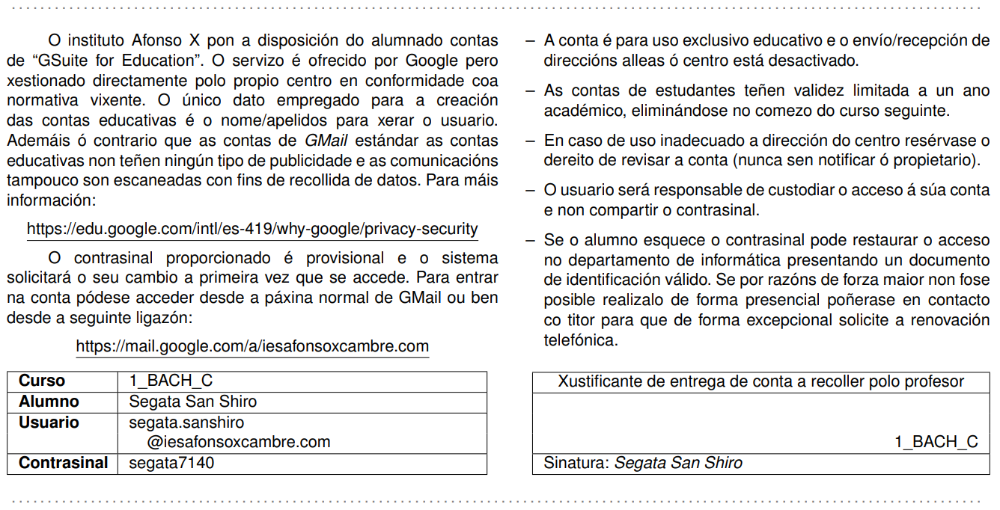

# Xade2GSuite

Create GSuite for Education accounts based on Xade CSV

Este programa toma el CSV generado por Xade y generará los siguientes documentos:
- Fichero HTML con el listado de cuentas del grupo para el profesor.
- Fichero PDF con el texto informativo para el alumnado y la información de login.
- Fichero CSV listo para subir al panel de administración de GSuite y crear todas las cuentas de alumno de forma automatizada.

En el fichero de entrada CSV proporcionado se puede ver un ejemplo de los campos a obtener mediante el generador de informes de Xade:
- Primeiro apelido
- Segundo apelido
- Nome alumno;
- Curso;
- Grupo;
- Ens. (abrev.)

El programa está escrito en C++ y se proporciona un Makefile para compilarlo.
Al ejecutar el programa sin parámetros nos indicará la lista de argumentos permitidos, como mínimo será necesario especificar el listado de alumnos para los que generar las cuentas.
El texto del PDF informativo para el alumndo puede ser personalizado en el fichero "header.tex", aunque el autogenerador de PDFs requiere tener LaTeX instalado.

[ Ejemplo de tarjeta generada ]

